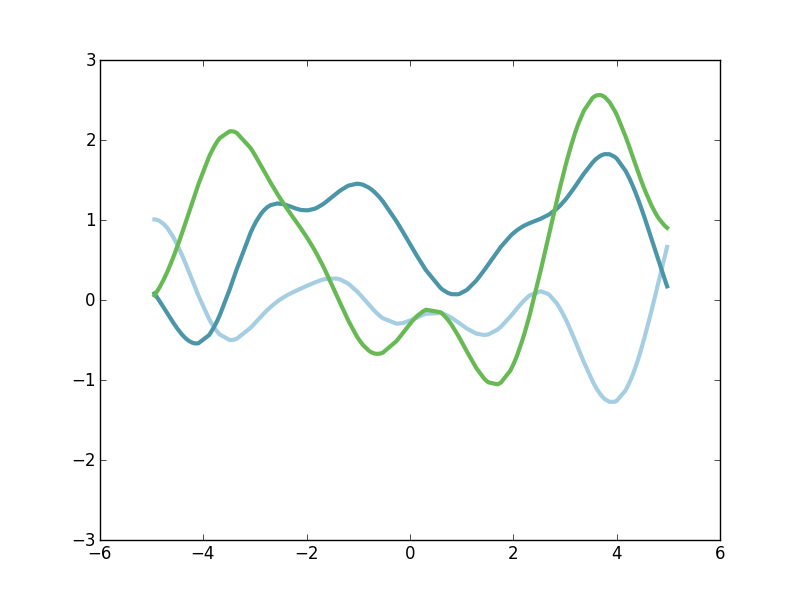

# Gaussian Processes

Some notes and code as I finally work through the [Rasmussen & Williams book](http://www.gaussianprocess.org/gpml/).

# Contents
1. [Use](#use)
2. [Kernels](#kernels)
3. [Sampling a GP](#sampling)
4. [Fitting](#fitting)
5. [Posterior](#posterior)

# Use

If you really just want to dive in and use the provided code, just clone the repo and install the required libraries.

Set up and activate a virtual environment.

```
cd some-file-path/gp
virtualenv env
source env/bin/activate
```

Then use pip to install required packages.

```
pip install -r requirements.txt
```

Then just run the main method in gp.py 

```
python gp.py -kernel se --length_scale 2 --sigma 1
```
This will result in two output images which provide visualizations of Gassian Process prior and posterior. Much more technical explanation and tutorial of all that follows below.


# Sampling
The Gaussian Process is a stochastic process that forms a probability distribution over the space of all smooth functions. Whereas a draw from a Gaussian _distribution_ will be a single point in a continuous sample space, a draw from a Gaussian _Process_ will be a smooth curve. The properties of that smooth curve are determined by the _kernel_ of the GP, but much more on that below. 

```python
from gp import GaussianProcess
from kernels import SE
import matplotlib.pyplot as plt
from matplotlib import cm

gp = GaussianProcess(SE(1,1))

plt.ylim(-3,3)
for i in range(0,3):
	f = gp.sample(1)[0]
	plt.plot(gp.x,f, linewidth=3, color = cm.Paired(i*30))
plt.savefig("static/gp_samples.png")

```


Above, I'm instatiting a GaussianProcess model with a "Squared Exponential" kernel. I then just take three draws from the GP and plot them. What do we notice about these draws? Again, they are arbitrary non-linear smooth functions, y(x). They have some wiggle to them, but not too much, and each of them are kind of dissimilar. The shapes and properties of these function draws depends strongly on which "kernel" we use with the GP.

# Kernels
 TODO


# Fitting
 TODO

# Posterior
 TODO
