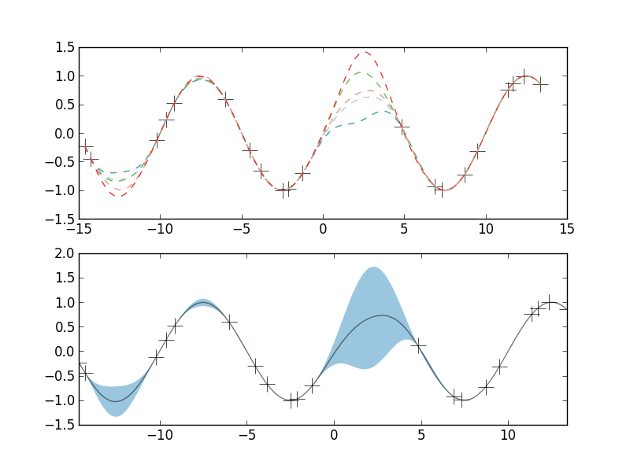
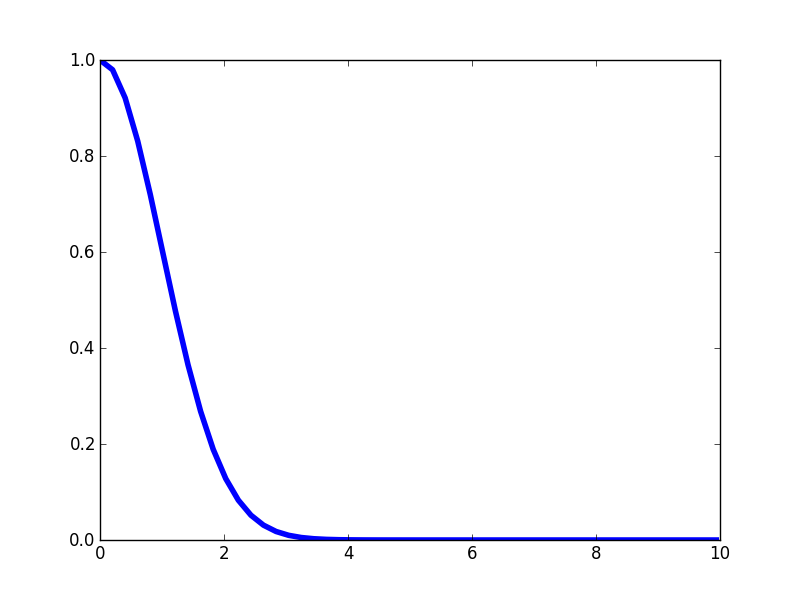
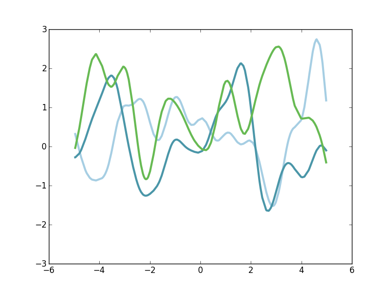
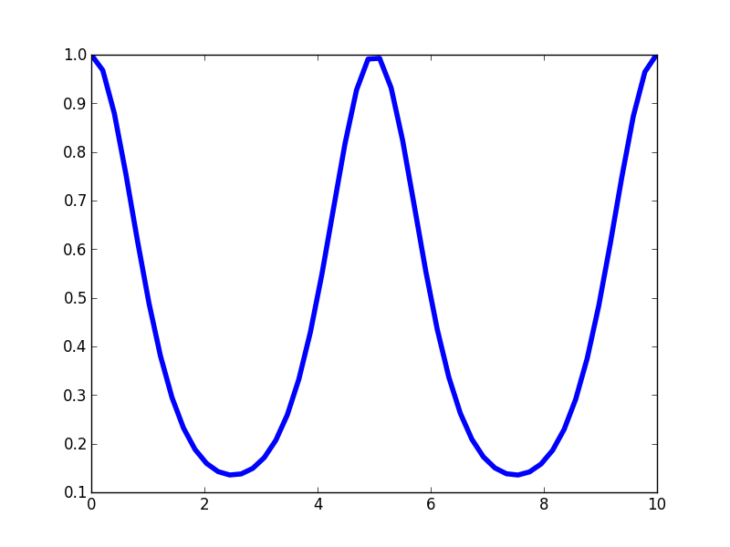
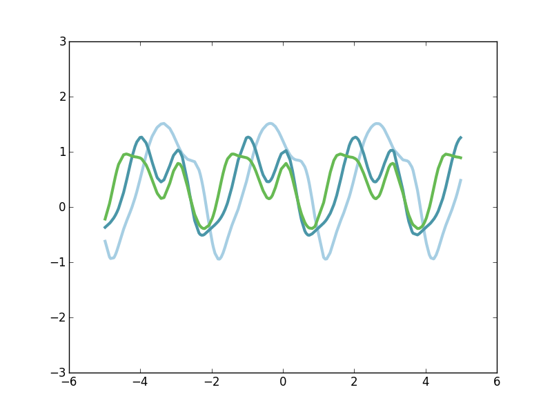
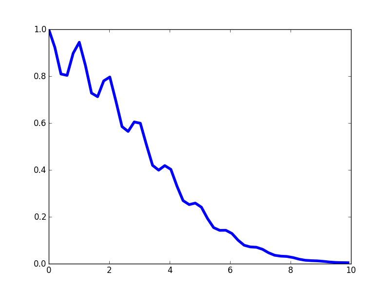
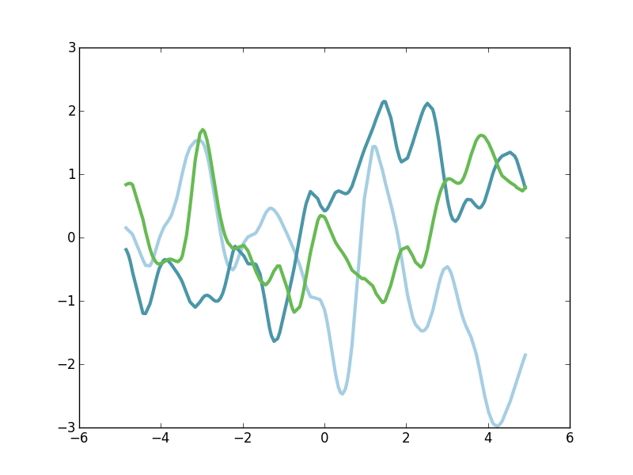
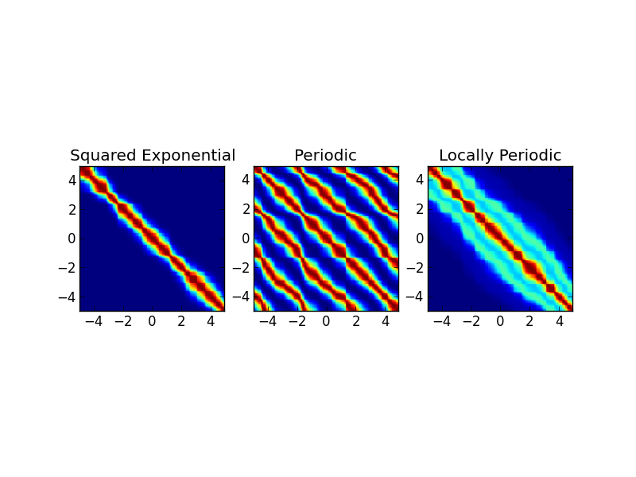

# Gaussian Processes

Some notes and code as I finally work through the [Rasmussen & Williams book](http://www.gaussianprocess.org/gpml/).

# Contents
1. [Use](#use)
2. [Kernels](#kernels)
3. [Sampling a GP](#sampling)
4. [Fitting](#fitting)
5. [Posterior](#posterior)

# Use

If you really just want to dive in and use the provided code, just clone the repo and install the required libraries.

Set up and activate a virtual environment.

```
cd some-file-path/gp
virtualenv env
source env/bin/activate
```

Then use pip to install required packages.

```
pip install -r requirements.txt
```

Then just run the main method in gp.py 

```
python gp.py -kernel se --length_scale 2 --sigma 1
```
This will result in two output images which provide visualizations of Gassian Process prior and posterior. Much more technical explanation and tutorial of all that follows below.




# Sampling
The Gaussian Process is a stochastic process that forms a probability distribution over the space of all smooth functions. Whereas a draw from a Gaussian _distribution_ will be a single point in a continuous sample space, a draw from a Gaussian _Process_ will be a smooth curve. The properties of that smooth curve are determined by the _kernel_ of the GP, but much more on that below. 

```python
from gp import GaussianProcess
from kernels import SE
import matplotlib.pyplot as plt
from matplotlib import cm

gp = GaussianProcess(SE(1,1))

plt.ylim(-3,3)
for i in range(0,3):
	f = gp.sample(1)[0]
	plt.plot(gp.x,f, linewidth=3, color = cm.Paired(i*30))
plt.savefig("static/gp_samples.png")

```


Above, I'm instatiting a GaussianProcess model with a "Squared Exponential" kernel. I then just take three draws from the GP and plot them. What do we notice about these draws? They are arbitrary non-linear smooth functions, y(x). They have some wiggle to them, but not too much, and each of them are kind of dissimilar. The shapes and properties of these function draws depends strongly on which "kernel" we use with the GP.

# Kernels
A Gaussian Process has two "parameters": a mean function and a covariance kernel. The mean function is just a function the defines the mean of all draws from the GP. For simplicity, we can make the mean function just the flat funciton y(x) = 0 for all x. The more interesting component is the kernel. The properties of the kernel play an important role in determining which kinds of functions are drawn from the GP.

So what is a kernel (as it relates to GPs)? A kernel is simply a function that takes in two points from the input data space, and returns a qnaitification of how "similar" we expect functions to be when evaluated at those two points. So for two points x_1 and x_2, our kernel k(x_1, x_2) will return a value that indicates how similar we expect y(x_1) and y(x_2) to be. 

As a concrete example, let's revisit the Squared Exponential kernel. With this kernel, we're basically asserting that when x_1 and x_2 are close together, we expect y(x_1) and y(x_2) to be highly close together. But as the distance between x_1 and x_2 increases, we are less confident in the relationship between y(x_1) and y(x_2). So for the Squares Exponential kernel, the kernel is maximized when x_1 - x_2 = 0 (the two points are the same) and then slowly rolls off as x_1 and x_2 become farther apart. With this kernel (and many others) the precise values of x_1 and x_2 don't matter but only the distance bewteen them (the kernel is translation invariant, or isometric). So we can plot a profile of the kernel as a function of the distance between our two hypothesized points.

```python
import numpy as np

x_dist = np.linspace(0, max(gp.x) + 5, num=50)
kern_value = [gp.kernel(0, thing) for thing in x_dist]
plt.plot(x_dist, kern_value, '-', linewidth=4)
plt.savefig("static/se_kern_1.png")
```



The kernel is maximized at x=0 (which is really the point where x_1 - x_2 = 0) and then gradually rolls off. The rate of that roll off is controlled by a "length scale" parameter that quantifies how far the correlations in x should extend. With a longer length scale, the kernel rolls of slower. With a smaller length scale, the kernel rolls of faster. Here's an example with a longer length scale. 

```python

gp = GaussianProcess(SE(5,1))

kern_value = [gp.kernel(0, thing) for thing in x_dist]
plt.plot(x_dist, kern_value, '-', linewidth=4)
plt.savefig("static/se_kern_2.png")
```


As I mentioned, the properties of the kernels have a big impact on the properties of the functions drawn from a GP. In the case of the SE kernel, the length scale of the kernel impacts the wiggles of the function. With a long length scale kernel, we expect long-range correlations in y(x) and thus the function draws are long and smooth. With a low length scale kernel, we get just the opposite: more wiggly functions that can change rapidly.

```python
gp = GaussianProcess(SE(5,1))
plt.ylim(-3,3)
for i in range(0,3):
	f = gp.sample(1)[0]
	plt.plot(gp.x,f, linewidth=3, color = cm.Paired(i*30))
plt.savefig("static/gp_samples_se_1.png")
```


```python
gp = GaussianProcess(SE(.5,1))
plt.ylim(-3,3)
for i in range(0,3):
	f = gp.sample(1)[0]
	plt.plot(gp.x,f, linewidth=3, color = cm.Paired(i*30))
plt.savefig("static/gp_samples_se_2.png")
```


So this length scale parameter of the Squared Exponential kernel has a big impact on what kinds of functions are generated by the GP. But the Squared Exponential kernel is just one possible kernel, there are many others. The Rasmussen and Williams book covers many common (and uncommon) kernels, and this [cheat sheet](http://www.cs.toronto.edu/~duvenaud/cookbook/index.html) from David Duvenaud is also a really nice resource. Instead of doing a detailed overview of the "kernel zoo", we'll get a sense for just a couple more.

The Periodic kernel is a popular one for generating functions that have some repetive components over a fixed periodicity. Let's take a look at the profile for this kernel.

```python
from kernels import Periodic

gp = GaussianProcess(Periodic(1,1,5))

x_dist = np.linspace(0, max(gp.x) + 5, num=50)
kern_value = [gp.kernel(0, thing) for thing in x_dist]
plt.plot(x_dist, kern_value, '-', linewidth=4)
plt.savefig("static/periodic_kern_1.png")
```



Here, the kernel profile shows us some similarities with the SE kernel, but also some interesting differences. Much like the SE kernel, this kernel is maximized at x-distance equal to zero and then falls off. But importantly, this kernel rises again to a value equal to that at x=0. And it does so at a value of x equal to the "period" of the kernel. That means that we expect values of y(x) to be highly correlated with values of y(x + period). And looking at the kernel profile, this fall-and-then-rise happens again indefinitely at each succesive period. The impace of this is that we expect to see functions which are highly correlated across some fixed periodicity. Let's take a look at some example draws from a GP with this kernel.

```python
gp = GaussianProcess(Periodic(1,1,3))
plt.ylim(-3,3)
for i in range(0,3):
	f = gp.sample(1)[0]
	plt.plot(gp.x,f, linewidth=3, color = cm.Paired(i*30))
plt.savefig("static/gp_samples_periodic_1.png")
```


With these three different draws from this GP, let's try to understand what's happening. We can immediately tell that each appears to be reptitive and periodic. But each draws looks completely different. What the Periodic kernel does is to draw and arbitrary non-linear smooth function (like we saw with the SE kernel), but then to repeat that basic form over and over again with a fixed periodicity. So again, we typically get an arbitrary wiggly function, but this waveform is then just repeated indefinitely. As you might guess, to alter how rapidly the repition occurs, we can simply adjust the period parameter of the kernel.

One final kernel to take a look at is a small varation on the Periodic kernel. The LocallyPeriodic kernel (it goes by many names) captures the same components as the Periodic kernel: an arbitrary smooth function is repeated across some fixed period. But the correlation dies off so that the periodicity isn't arbitrarily strong forever. Instead, the periodic component is most strong locally, but then melts away like a SE kernel. Let's take a look at this kernel profile.

```python
from kernels import LocallyPeriodic

gp = GaussianProcess(LocallyPeriodic(1.5,1,2))

x_dist = np.linspace(0, max(gp.x) + 5, num=50)
kern_value = [gp.kernel(0, thing) for thing in x_dist]
plt.plot(x_dist, kern_value, '-', linewidth=4)
plt.savefig("static/lp_kern_1.png")
```


Similar to the SE kernel, the overall kernl value tends to melt away with distance. But similar to the Periodic kernel, there are periodic peaks in the kernel value that embues functions with correlations on a fixed timescale. Let's take a look at some draws.

```python
gp = GaussianProcess(LocallyPeriodic(1.5,1,2))
plt.ylim(-3,3)
for i in range(0,3):
	f = gp.sample(1)[0]
	plt.plot(gp.x,f, linewidth=3, color = cm.Paired(i*30))
plt.savefig("static/gp_samples_lp_1.png")
```


These functions are a little harder to digest, but we can sort of see what I was describing. There's definitely repeated structure of a fixed period or frequency. But the waveform isn't perfectly repeated at that periodicity. Instead, there's slowly-evolving differences in the function, and we tend to just see some qualitative structural similarities at each period.

There's one more way of thinking about kernels that might be helpful to explore at this point. Let's pick a kernel, and then let's just pick a range of x-data and evaluate the kernel for every pairwise combination of values that we have. We can either pick a grid of x-values or even just randomly sampled x-values, the end result will be similar. So then, if we have N different x-values, we'll have N^2 different pairwise combination of x-values. And for each of those pairs, we've computed the kernel value and can keep track of this NxN matrix, which we'll call the Covariance matrix. In fact, this procedure is exactly one of the necesary steps for computing and sampling GP models (though I'm intentionally leaving all the mathematical details out of here). Instead, we can just **visualize** the kernel Covariance. In my GaussianProcess class, I've pre-computed this kernel Covariance prior, so visualization is a breeze.


```python
gp_se = GaussianProcess(SE(.5,1))
gp_per = GaussianProcess(Periodic(1,1,3))
gp_lp = GaussianProcess(LocallyPeriodic(1.5,1,2))

from matplotlib.gridspec import GridSpec
fig=plt.figure()
gs=GridSpec(1,3)

ax1=fig.add_subplot(gs[0,0])
plt.imshow(gp_se.covariance, extent=[min(gp_se.x), max(gp_se.x), min(gp_se.x), max(gp_se.x)])
plt.title("Squared Exponential")

ax1=fig.add_subplot(gs[0,1])
plt.imshow(gp_per.covariance, extent=[min(gp_per.x), max(gp_per.x), min(gp_per.x), max(gp_per.x)])
plt.title("Periodic")

ax1=fig.add_subplot(gs[0,2])
plt.imshow(gp_lp.covariance, extent=[min(gp_per.x), max(gp_per.x), min(gp_per.x), max(gp_per.x)])
plt.title("Locally Periodic")

plt.savefig("static/kernel_covar.png")
```



In general, these kernel covariances look a little "choppy" because I'm randomly sampling x-values instead of doing a fixed great, so the heatmap vizualization looks a little rough. But there's enough to get a sense of things. In each plot, red correspond to values of high correlation and blue corresponds to values of low correlation. Remember that the x and y axes are plotting the (sampled) range of x-values. 

On the left is the covariance matrix for the Squared Exponential kernel. The diagonal of this covariance is highly red. That's because the diagonal of this matrix is all value where x_1 and x_2 are very close, and for the SE kernel, we know that's the situation where the kernel is maximized. From the diagonal, the kernel "diffuses" in color symmetrically in both directions. In fact, any given horizontal "slice" through the covariance matrix would just be the kernel profile plot we've looked at before (this is true for all the kernels). For the SE kernel, if we adjusted the length scale parameter, the effect would be to change how narrow or diffuse the band around the diagonal is.

In the middle is the Covariance for the Periodic kernel. Note that this too has a bright band down the diagonal, as expected. However, we also see symmetric bands of high correlation that are parallel to the diagonal. Further, the bands are separated by a fixed period. And on the right, we have the Covariance for the LocallyPeriodic kernel. Again, note the diagonal banding. In may be a little hard to see, but we also see some off-diagonal parallel banding, but that dies off quickly. This way of visualizing kernel Covariances tell us exactly different points in the x-space will be related via the kernel. Since all the kernels we've talk about so far are isometric, the kernel profile visualization conveys the same kind of information as well. 

So we've seen that a draw from a Gaussian Process is a non-linear smooth function and that the properties of the GP's kernel has a big impact on nature of those functions. We haven't actually talked about _how_ to draw samples from a GP, and I don't intend to here, in order to keep the mathematical details tucked away. But instead let's turn to _why_: what can we use this stuff for?

# Fitting


# Posterior
 TODO
