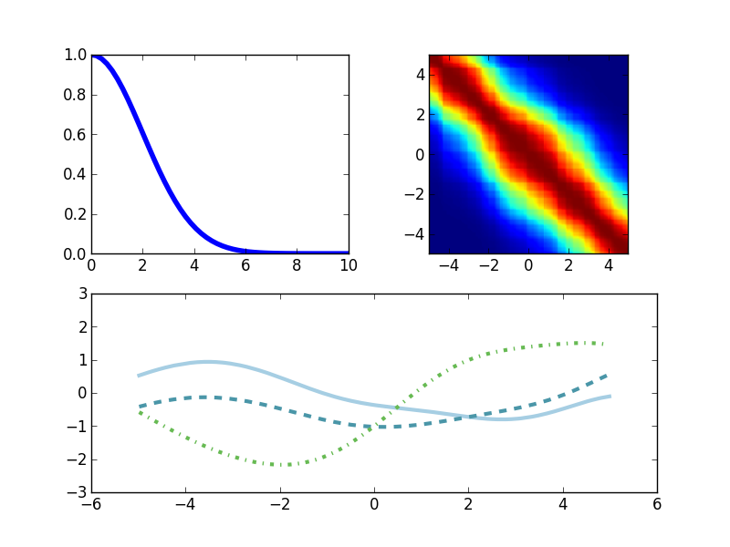

# Gaussian Processes

Some notes and code as I finally work through the [Rasmussen & Williams book](http://www.gaussianprocess.org/gpml/).

# Contents
1. [Use](#use)
2. [Kernels](#kernels)
3. [Sampling a GP](#sampling)
4. [Fitting](#fitting)
5. [Posterior](#posterior)

# Use

If you really just want to dive in and use the provided code, just clone the repo and install the required libraries.

Set up and activate a virtual environment.

```
cd some-file-path/gp
virtualenv env
source env/bin/activate
```

Then use pip to install required packages.

```
pip install -r requirements.txt
```

Then just run the main method in gp.py 

```
python gp.py -kernel se --length_scale 2 --sigma 1
```
This will result in two output images which provide visualizations of Gassian Process prior and posterior. Much more technical explanation and tutorial of all that follows below.




# Sampling
The Gaussian Process is a stochastic process that forms a probability distribution over the space of all smooth functions. Whereas a draw from a Gaussian _distribution_ will be a single point in a continuous sample space, a draw from a Gaussian _Process_ will be a smooth curve. The properties of that smooth curve are determined by the _kernel_ of the GP, but much more on that below. 

```python
from gp import GaussianProcess
from kernels import SE
import matplotlib.pyplot as plt
from matplotlib import cm

gp = GaussianProcess(SE(1,1))

plt.ylim(-3,3)
for i in range(0,3):
	f = gp.sample(1)[0]
	plt.plot(gp.x,f, linewidth=3, color = cm.Paired(i*30))
plt.savefig("static/gp_samples.png")

```


Above, I'm instatiting a GaussianProcess model with a "Squared Exponential" kernel. I then just take three draws from the GP and plot them. What do we notice about these draws? They are arbitrary non-linear smooth functions, y(x). They have some wiggle to them, but not too much, and each of them are kind of dissimilar. The shapes and properties of these function draws depends strongly on which "kernel" we use with the GP.

# Kernels
A Gaussian Process has two "parameters": a mean function and a covariance kernel. The mean function is just a function the defines the mean of all draws from the GP. For simplicity, we can make the mean function just the flat funciton y(x) = 0 for all x. The more interesting component is the kernel. The properties of the kernel play an important role in determining which kinds of functions are drawn from the GP.

So what is a kernel (as it relates to GPs)? A kernel is simply a function that takes in two points from the input data space, and returns a qnaitification of how "similar" we expect functions to be when evaluated at those two points. So for two points x_1 and x_2, our kernel k(x_1, x_2) will return a value that indicates how similar we expect y(x_1) and y(x_2) to be. 

As a concrete example, let's revisit the Squared Exponential kernel. With this kernel, we're basically asserting that when x_1 and x_2 are close together, we expect y(x_1) and y(x_2) to be highly close together. But as the distance between x_1 and x_2 increases, we are less confident in the relationship between y(x_1) and y(x_2). So for the Squares Exponential kernel, the kernel is maximized when x_1 - x_2 = 0 (the two points are the same) and then slowly rolls off as x_1 and x_2 become farther apart. With this kernel (and many others) the precise values of x_1 and x_2 don't matter but only the distance bewteen them (the kernel is translation invariant, or isometric). So we can plot a profile of the kernel as a function of the distance between our two hypothesized points.

```python
import numpy as np

x_dist = np.linspace(0, max(gp.x) + 5, num=50)
kern_value = [gp.kernel(0, thing) for thing in x_dist]
plt.plot(x_dist, kern_value, '-', linewidth=4)
plt.savefig("static/se_kern_1.png")
```


The kernel is maximized at x=0 (which is really the point where x_1 - x_2 = 0) and then gradually rolls off. The rate of that roll off is controlled by a "length scale" parameter that quantifies how far the correlations in x should extend. With a longer length scale, the kernel rolls of slower. With a smaller length scale, the kernel rolls of faster. Here's an example with a longer length scale. 

```python

gp = GaussianProcess(SE(5,1))

kern_value = [gp.kernel(0, thing) for thing in x_dist]
plt.plot(x_dist, kern_value, '-', linewidth=4)
plt.savefig("static/se_kern_2.png")
```


As I mentioned, the properties of the kernels have a big impact on the properties of the functions drawn from a GP. In the case the SE kernel, the length scale of the kernel impacts the wiggles of the function. With a long length scale kernel, we expect long-range correlations in y(x) and thus the function draws are long and smooth. With a low length scale kernel, we get just the opposite: more wiggly functions that can change rapidly.

```python
gp = GaussianProcess(SE(5,1))
plt.ylim(-3,3)
for i in range(0,3):
	f = gp.sample(1)[0]
	plt.plot(gp.x,f, linewidth=3, color = cm.Paired(i*30))
plt.savefig("static/gp_samples_se_1.png")
```


```python
gp = GaussianProcess(SE(.5,1))
plt.ylim(-3,3)
for i in range(0,3):
	f = gp.sample(1)[0]
	plt.plot(gp.x,f, linewidth=3, color = cm.Paired(i*30))
plt.savefig("static/gp_samples_se_2.png")
```


# Fitting
 TODO

# Posterior
 TODO
